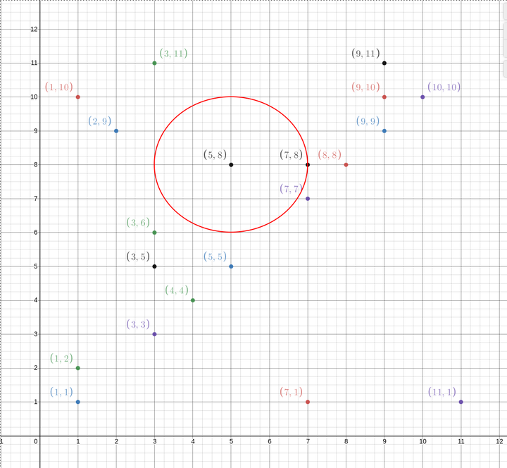
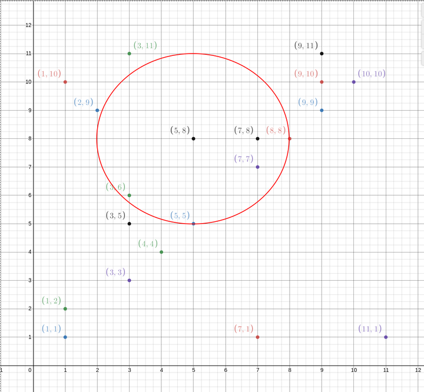

# Сензори за мръсен въздух

Имате компания, която мери нивата на лош въздух в София. Имате сензори в целия град. Понякога сензорите се чупят или започват да дават неверни резултати. Поради тази причина на повечето места сте сложили повече от 1 сензор.

Можете да разберете дали даден сензор е в неизправност, ако има много голяма разлика между неговата стойност и стойностите на сензорите, които са му "съседни".

## Съседни сензори

Нека вземем сенсор (5,8).

На картинката са показани неговите близки сензори, когато дистанцията е 2:


Когато дистанцията е 3:


## Задачата

Информацията за сензорите се намира във файл ([тук](sensors_data1.txt) има примерен). Всеки ред във файла репрезентира един сензор с неговите координати и нивото на мръсен въздух, който е измерил.

На избран от вас език, напишете програма, която чете от файл и изкарва всички възможни неизправни сензори. Името на файла, максималната дистанция, която дефинира близки сензори и максималната позволена грешка между сензорите се получават от стандартния вход.

Формат на файла:

```
3,4,100
3,3,100
4,3,20
10,9,200
9,9,180
7,6,50
7,5,300
1,1,100
```

Всеки ред от файла репрезентира 1 сензор. Първите 2 колони са координатите на сензорите (X,Y), а в последната се намира стойността на сензора за мръсен въздух.

> Ако няма проблемни сензори, изведете: "All sensors are OK."

## Пример

Input:

```
Filename: sensors_data.txt
Neighbours distance: 1
Max error: 50
```

Output:

```
Please check sensors at: (3,5), (3,6)
```
