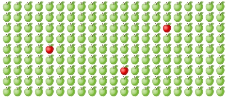
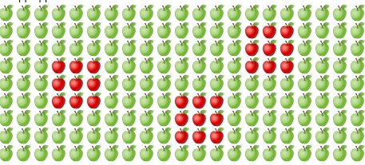
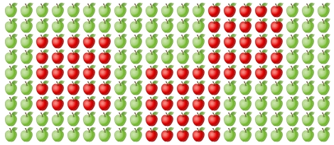
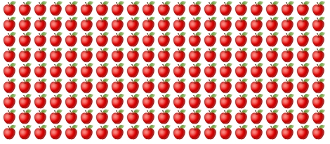

## Гниещи ябълки

В къщата, в която живеете, имате огромно ябълково дърво. Дървото е родило за поредна година и вие събирате реколтата от ябълки в касетки с различна големина. Налага ви се да заминете извън града за няколко дни малко след като сте събрали реколтата.

## Задачата

Знаете, че ако една ябълка е изгнила, след 3 дни всички ябълки около нея ще са изгнили.

На избран от вас език, напишете програма, която от стандарния вход чете:

- големината на касетката - N x M (**ЗАБЕЛЕЖКА: Касетките нямат нулев ред или колона.**)
- координатите на изгнилите ябълки
- след колко дни ще се върнете в къщата си

Изведете как изглежда касетката след този период.

- O - свежа ябълка
- X - изгнила ябълка

## Пример

- :green_apple: - свежа ябълка
- :apple: - изгнила ябълка

В началото:



След 3 дни:



След 7 дни:



След 100 дни:



## Примерен I/O

Входни данни:

```
Enter the size of the box: 20x10
Еnter the coordinates of the rotten apples: (3,8) (16,4)
After how many days will you come back: 10
```

Изход:

```
OOOOOOOOOOOOXXXXXXXO
OOOOOOOOOOOOXXXXXXXO
OOOOOOOOOOOOXXXXXXXO
OOOOOOOOOOOOXXXXXXXO
XXXXXXOOOOOOXXXXXXXO
XXXXXXOOOOOOXXXXXXXO
XXXXXXOOOOOOXXXXXXXO
XXXXXXOOOOOOOOOOOOOO
XXXXXXOOOOOOOOOOOOOO
XXXXXXOOOOOOOOOOOOOO
```
