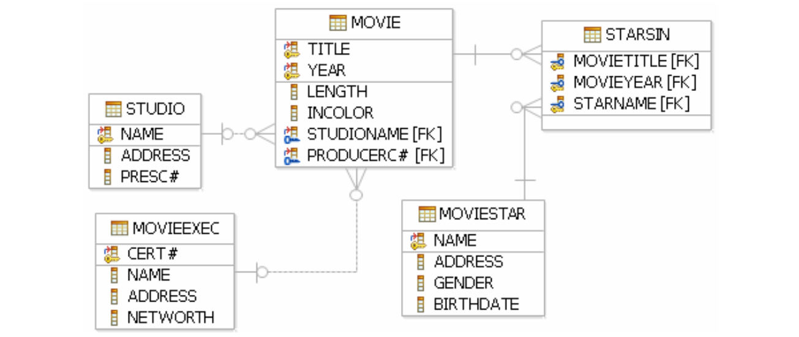

# Introduction to Databases and SQL

Presentation: https://slides.com/hackbulgaria/python-101-9th-sql/

## Task 1: Tables, tables everywhere! SELECT, UPDATE, INSERT, DELETE

Now, we know that our languages table looks like this:

| id      | language  | answer  | answered | guide |
| ------------- |:-------------:| --- | --- |-----:|
1|Python|google|0|A folder named Python was created. Go there and fight with program.py!
2|Go|200 OK|0|A folder named Go was created. Go there and try to make Google Go run.
3|Java|object oriented programming|0|A folder named Java was created. Can you handle the class?
4|Haskell|Lambda|0|Something pure has landed. Go to Haskell folder and see it!
5|C#|NDI=|0|Do you see sharp? Go to the C# folder and check out.
6|Ruby|https://www.ruby-lang.org/bg/|0|Ruby, ruby, rubyyy, aaahaaaahaa! (music). Go to Ruby folder!
7|C++|header files|0|Here be dragons! It's C++ time. Go to the C++ folder.
8|JavaScript|Douglas Crockford|0|NodeJS time. Go to JavaScript folder and Node your way!

Your task is to write queries for:

* Create database
* Create table `Languages` with columns and attributes with the correct types
* Insert data
* Add new column `rating` which is number from 1 to 9. Insert values for every language.
* For few languages (`Python` and `Go`) update answered value from 0 to 1
* Select languages which answer is `200 OK` or `Lambda`.

## Task 2: Database schema

## First Queries
1. Напишете заявка, която извежда адреса на студио ‘MGM’
2. Напишете заявка, която извежда рождената дата на актрисата `Kim Basinger`
3. Напишете заявка, която извежда имената всички продуценти на филми с
нетни активи (networth) над 10 000 000 долара
4. Напишете заявка, която извежда имената на всички актьори, които са
мъже или живеят на Prefect Rd
5. Добавате нова филмова звезда 'Zahari Baharov', с адрес и рожденна дата по ваш избор.
6. Изтрийте всички студия, които имат в адреса си числото 5.
7. Променете студио да бъде "Fox" на тези филми, които в имената си имат 'star.

## Relations

1. Напишете заявка, която извежда имената на актьорите мъже участвали в ‘Terms
2. of Endearment’
3. Напишете заявка, която извежда имената на актьорите участвали във филми
продуцирани от ‘MGM’през 1995 г.
4. Добавете колона "име на президент"на таблицата Студио и съответно и задайте стойности.Напишете заявка, която извежда името на президента на ‘MGM’
