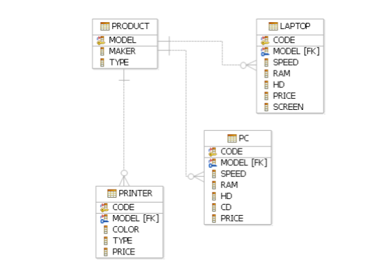

## За базата от данни PC

• Напишете заявка, която извежда средната скорост на компютрите

• Напишете заявка, която извежда средния размер на екраните на лаптопите за
всеки производител.

• Напишете заявка, която извежда средната скорост на лаптопите с цена над 1000.

• Напишете заявка, която извежда средната цена на компютрите според различните им hd.

• Напишете заявка, която извежда средната цена на компютрите за всяка скорост по-голяма от 500.

• Напишете заявка, която извежда средната цена на компютрите произведени от производител ‘A’.

• Напишете заявка, която извежда средната цена на компютрите и лаптопите за производител ‘B’

• Напишете заявка, която извежда производителите, които са произвели поне по 3 различни модела компютъра. Помислете каква заявка можете да напишете за да сте сигурни в отговора, например да изведете за всеки производител, броя различни модели компютри.

• Напишете заявка, която извежда производителите на компютрите с най-висока цена.

•Напишете заявка, която извежда средния размер на диска на тези компютри произведени от производители, които произвеждат и принтери.
