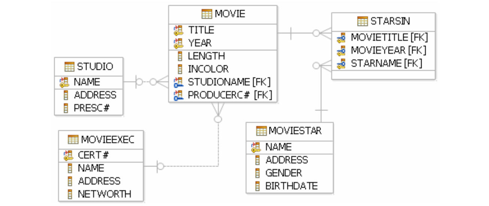

## Database schema

## First Queries
1. Напишете заявка, която извежда адреса на студио ‘MGM’
2. Напишете заявка, която извежда рождената дата на актрисата `Kim Basinger`
3. Напишете заявка, която извежда имената всички продуценти на филми с
нетни активи (networth) над 10 000 000 долара
4. Напишете заявка, която извежда имената на всички актьори, които са
мъже или живеят на Prefect Rd
5. Добавате нова филмова звезда 'Zahari Baharov', с адрес и рожденна дата по ваш избор.
6. Изтрийте всички студия, които имат в адреса си числото 5.
7. Променете студио да бъде "Fox" на тези филми, които в имената си имат 'star.

## Relations

1. Напишете заявка, която извежда имената на актьорите мъже участвали в ‘Terms
2. of Endearment’
3. Напишете заявка, която извежда имената на актьорите участвали във филми
продуцирани от ‘MGM’през 1995 г.
4. Добавете колона "име на президент"на таблицата Студио и съответно и задайте стойности.Напишете заявка, която извежда името на президента на ‘MGM’
